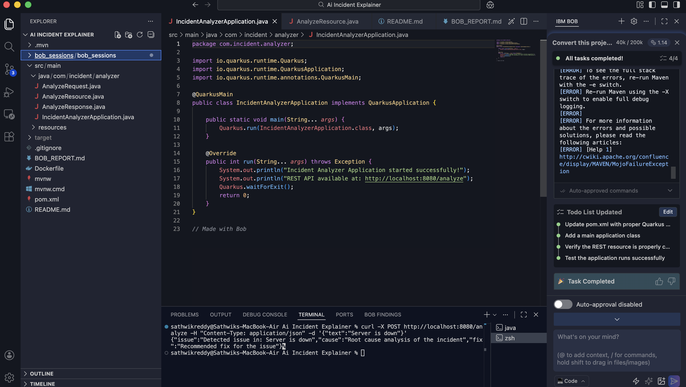

# Task 1: Project Setup

## Prompt
Create a Quarkus REST API project.

## What BoB did
- Generated project structure
- Configured Maven (pom.xml)

## Result
Project successfully created.

## Screenshot 
