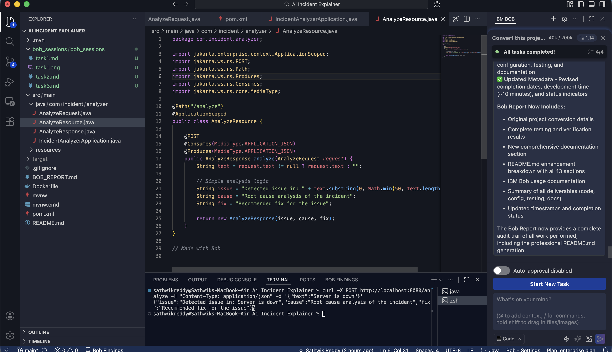

# Task 2: Create API Endpoint

## Prompt
Create an endpoint to analyze incidents.

## What BoB did
- Created /analyze endpoint
- Added request and response classes

## Result
API returns issue, cause, and fix.

## Screenshot
