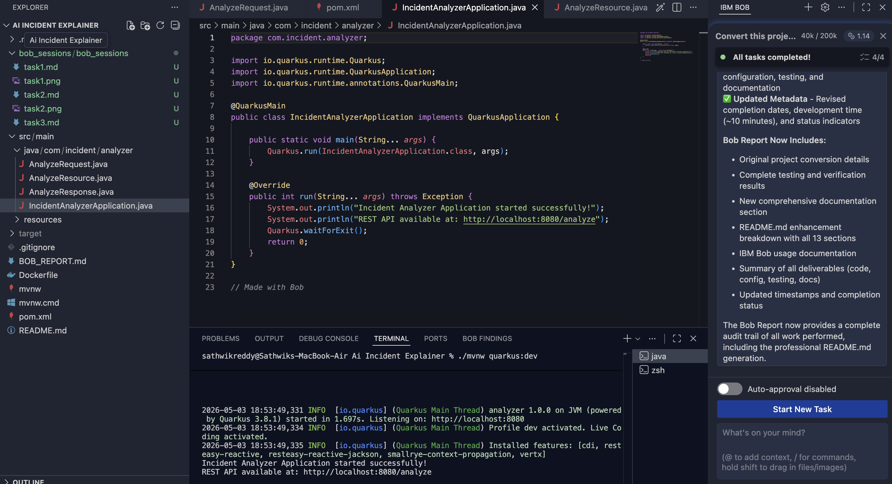

# Task 3: Test API

## Prompt
Test API using curl.

## Command
curl -X POST http://localhost:8080/analyze \
-H "Content-Type: application/json" \
-d '{"text":"Server is down"}'

## Result
API returned JSON output successfully.

## Screenshot
